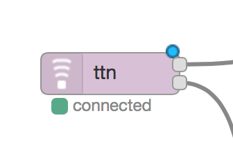

# Node RED TTN node


The Node RED TTN node emits messages and activation events from a specific
application.

## Installation

To install you do

```
npm install -g node-red-contrib-ttn
```
or
```
cd ~/.node-red
npm install node-red-contrib-ttn
```
and restart node-RED. The node should now be visible in the *input* category.

## Usage



The node has two outputs:

  - Messages sent by devices on the application are sent on the upper node output:
  ```
  { 
    "payload": {
      "foo": "AA=="
    },
    "appEUI": "70B3D57ED00001DA",
    "devEUI": "00000000973572D0",
    "counter": 38,
    "_msgid": "6e29afc4.91d65",
    "metadata": { 
      "frequency": 868.32684,
      "datarate": "SF8BW125",
      "codingrate": "4/5",
      "gateway_timestamp": 1,
      "gateway_time": "2016-05-25T20:34:12.55856605Z",
      "channel": 0,
      "server_time": "2016-05-25T20:34:12.555147951Z",
      "rssi": -1,
      "lsnr": 1.4,
      "rfchain": 0,
      "crc": 0,
      "modulation": "LoRa",
      "gateway_eui": "0102030405060708",
      "altitude": 0,
      "longitude": 0,
      "latitude": 0
    }
  }
  ```

  - Device activation events are sent from the lower node output:
  ```
    { devEUI: "00000000973572D0" }
  ```
